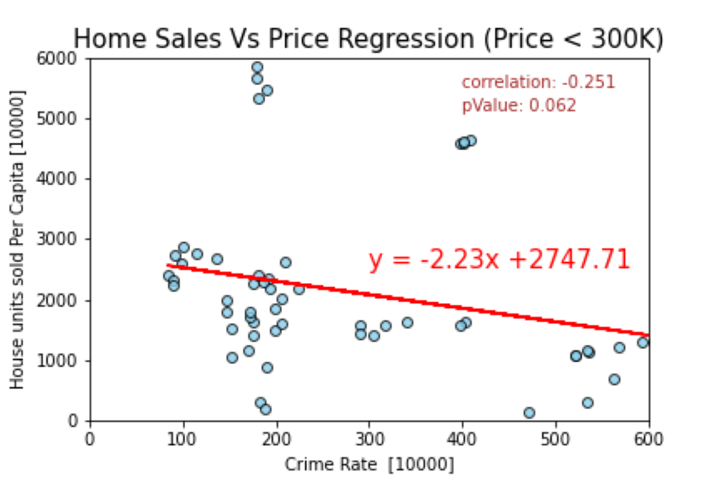

## Effect of Crime on the Housing Market in the Houston Metro-Area

## Introduction:
The largest and most important purchase that a consumer will make in his lifetime is a house. A lot of time and energy goes into determining exactly what one wants in a new home. The buyer must figure out their preferences regarding the location of the house, including the city, neighborhood, and proximity to certain amenities and general aesthetic style while a significant amount of attention is drawn into crime, school and life quality. Theoretically, homebuyers would pay a premium in order to live in a physically safe environment to avoid crime, as well as the mental security of knowing that they are safe.  In this report we will take a closer look into the methodology and results of analyzing Houston and a selection of surrounding cities’ crime data and housing market. The analysis in this report focuses on the years between 2012-2018 and examines the following:

* What is the average crime rate across the top 10 largest cities in the Houston metropolitan area?
* What is the average and median sales price across the top 10 largest cities in the Houston metropolitan area?
* Do houses stay on the market longer in higher crime areas?
* Is there a correlation between average or median sales price and the average or median crime rate crime?
* Do violent crimes or non-violent crimes have a bigger impact on home sales?
* Is there a correlation between houses sold and crime rates in houston?

## Methodology
The study performed relied on two major data sets. The housing market data set from Redfins and a crime data set from the FBI’s Uniform Crime Reporting and housing data from Census. It was noted that the available information for the housing data extended from 2012 to 2020. However, the crime data only had summarized results per city up to the year 2018. The decision was made to utilize only data that had overlapping years, therefore focusing on 2012-2018.
Our next step was to determine what cities the study would focus on. The study focused on a 50-mile radius from Houston and only looked at a list of 10 cities with a population size greater than 30,000, this population cap would allow the data to be compared on a per capita basis. The cities that were looked at for the study are as follows: Baytown, Friendswood, Galveston, Houston, La Porte, League City, Missouri City, Pasadena, Sugar Land, and Texas City.

## Crime Analysis
In order to compare the number of crimes based from city to city, the values were changed to represent crime values per 10,000 people. We then focused on determining plotting the crime over the 2012-2018 time period to gain an understanding of how the crime rate looked like for the individual cities. The graph shown below illustrates that there is no visual significant change to indicate that crime rate is decreasing among the cities. The five least dangerous cities all stay around their respective crime rate per year. Whereas there is more slight volatility with the five most dangerous cities. 

The next step in the study was to determine the mean per city. This would allow us to visualize a comparison between each respective city for the 7-year period. The graph below shows the cities ranked from most to least dangerous based on crime rate per 10,000 people.

The graph also shows a breakdown between the types of crimes each city has, whether it is violent crimes or property crime. These two values along with the total were accounted for to utilize when comparing housing market data against total crime, violent crime, and property crime. The goal is to determine if there is any correlation among housing market parameters and the three crime parameters. The table shows the values utilized to create the bar graph.

## Housing Analysis
Now as we look around Houston and it’s surrounding cities/suburbs, we want to get an idea of what the housing market looks like throughout the area. The primary trend for the observed period is up in the period from 2012 to 2018, which is inline with housing prices nationwide in that timeframe. 

Looking more specifically into the sample of cities discussed. The median prices go from $73,000 to just over $300,000. Sugar Land is the most expensive city during the whole study period and Texas City has the cheapest housing prices in the market, the difference between these two cities got to be upwards of $200,000 and the distance between these two cities is of about 50 miles. If one could split the sample cities into group one could argue that there are three groups with similar trends. The more expensive group would contain Sugar Land, Missouri City, League City, and Friendswood, the second group would have Houston itself and Galveston, and the lowest-priced group would include Baytown, La Porte, Pasadena and Texas City.

Another useful set of datapoints when analyzing the housing trends in the Houston area and it’s surrounding is the average days on market:

It was observed that in the city of Galveston, by far houses have stayed in the market for longer than in the rest of the studied areas with Texas City and Baytown coming in next, which now shows how these two cities are both in the lower average housing prices range as well as with the most days on market on average before finalizing a sale 

## Crime Rate and Housing Market Analysis
In order to create a comparison between two independent variables, we did regression analysis to determine if there are any trends in the two data sets. The first plots focused on determining relationship between median sales price vs crime rate per 10,000 people for the selected cities. In addition, a secondary plot was generated to compare the average days that homes are on the market vs crime rate per 10,000 people for the selected cities. The results are as follows:

Graph_1:

Graph_2:

The correlation coefficient for median sales price vs crime per capita (Graph_1) is -0.5, which suggests that there is a slight inverse correlation among the two parameters. Indicating that as crime rate increases for any particular city the median sales price decreases. However, as suspected this may be because there are other factors at play that are affecting the overall median sales price besides the crime alone. With the house on market graph, we see that the values overall are more scattered, therefore suggesting once again that other parameters are playing a factor.

## Home Sales Analysis

Our Crime and Home Sales Analysis indicated a trend between Crime Rate and Housing Market. We wanted to get a better insights into influence of crime rate on housing market. We decided to use a different data source to do more detailed analysis. We choose American Housing Survey from Census to perform our analysis. 

We focussed our analysis on the effects of crime on the home sales for the past seven years. To do the analysis we targeted the sales of homes with prices less than $300k, prices between $300K-$500K. We created scatter plots for the home sales less than $300k. The plot had more dense concentrations (indicating more sales) in the areas where there is less crime compared to the areas where there is more crime. We also performed regression analysis to look for trends in the home sales for the prices less than $300K. However the impact of crime is not very high for the home sales within this group. The analysis results are as follows 

Scatter_Graph_1

Regression_Graph_1

We continued with our analysis for the home sales in the price group 300K-500K. We noticed that the home sales is very high for the areas with lesser crime rates. There was ahigh negative co-relation with (pValue :0.002) with this group. The analysis results are as follows:

Scatter_Graph_2

Regression_Graph_2

We also did a similar analysis to the sales of homes within 500K to 1M. There was a negative co-relation (pvalue: 0.019) indicating the home sales are significantly affected by crime rate. The analysis results are as follows :

Regression_Graph_3

Our next focus was to compare and contrast the general home sales trend in the different cities in the Houston metropolitan area. We choose Houston, League City, Friendswood (cities with highest crime rate to lowest crime rate). the analysis would provide us better insights into the influence of crime rate on home sales. Our graph showed the home sales is highest for the friendswood, followed by League City and by Houson. The chart shows the similar trend, where the home sales are higher at safer cities. The results are below :

We did a similar comparison analysis to compare the sales of the homes at Sugarland with houston.The average sales price for Sugarland was highest. The average home sales was higher for sugarland compared to houston, even with higher home prices

Furthur more analysis to compare the sales of the homes at Baytown with houston.
The average home sales was higher for Baytown compared to houston

Based on our analysis on the Crime Rate Vs Home Sales, in the past seven years more houstonites are purchasing homes at the safer neighborboods. The home sales tends to fall where the crime rates are high. 

## Observations

When looking at crime rate and the housing market in the Houston metropolitan area we observed:

	* No significant change in crime rate has occurred since 2012, while home prices have gone up overall
	* There are more homes sold in safer neighborhoods while home sales decrease as crime rate increases
	* There trend for the home sales with crime rate is the same when analyzing home values

While we see there is a relationship between the crime rate and the housing market, we acknowledge there are other factors affecting the housing market such as school districts, amenities, commute times,  demographics, etc.

	* There is a moderate inverse correlation (-0.5) between crime and the housing prices	
	* There is a low correlation (0.33) between crime and the days on market

## References
1. Crime Data: https://www.fbi.gov/services/cjis/ucr/publications
2. Housing Market Data: https://www.redfin.com/blog/data-center/
3. Google API: https://maps.googleapis.com/maps/api/geocode/json
4. American Housing Survey (AHS): https://www.census.gov/data/developers/data-sets.html

## Project Structure 

## Src_files 

    The project code is in this folder. The list of files with its purpose is mentioned below

    * CrimeData 
         The module to process crime data and build analysis charts and graphs related to Crime Data
    
     * HousintMarket
        The module to process the housing market data and build analysis graphs and charts related to Housing market

    * CrimeHousingMarketAnalysis
        The module to merge the crime and housing data and build analysis graphs and charts related to Crime and Housing market

    * HousingAnalysisWithPrice
         The module to merge the crime and housing census data and build analysis graphs and charts to home sales within 
         different price groups
         
    * HousingAnalysisForDifferentCities
         The module to merge the crime and housing census data and build analysis graphs and charts to home sales within 
         different price groups
   
     * gmaps
          The module uses google apis to map the cities
         
     * HousingUnitsCensus
         The module to retrieve housing census data from Income census API
     
     * IncomeCensus
         The module to retrieve income census data from Income census API

## Images
    The folder contains our analysis graphs and charts

## Resources
     The folder contains the datasets used for the project

## Proposal
     The folder contains our project proposal

## Presentation
    The folder contains our project presentation
 
